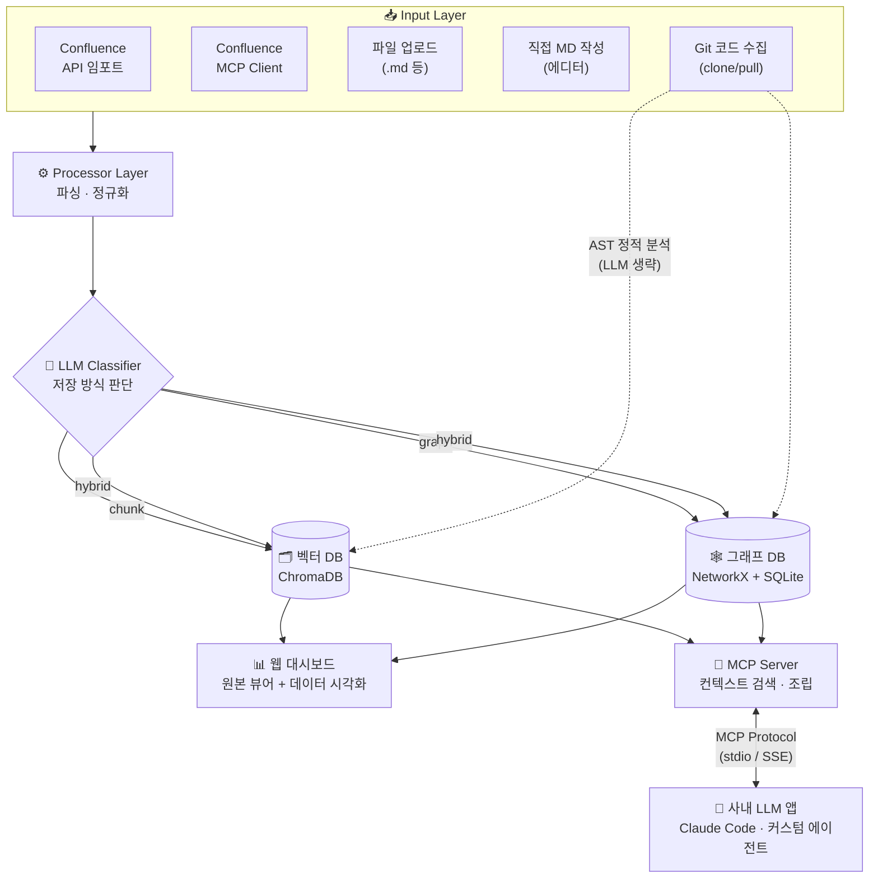
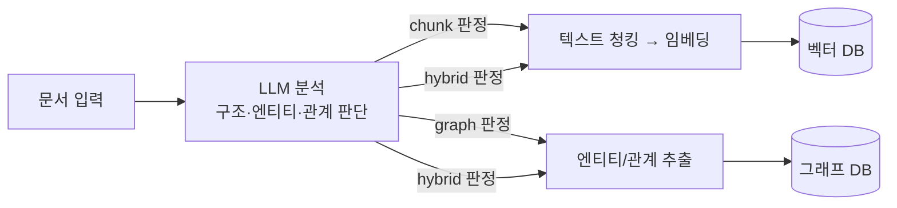
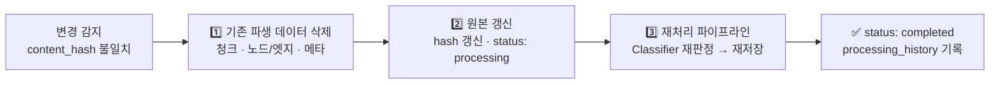
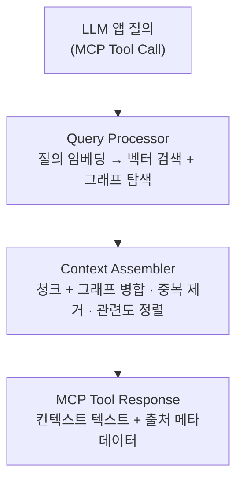

<div align="center">

# 🔄 Project Context Loop System

**사내 지식을 LLM 컨텍스트로 변환·저장하고, 웹 대시보드와 MCP Server로 관리하는 시스템**

<p>
  
  
  
  
  
</p>

<p>
  <a href="#-주요-기능">주요 기능</a> •
  <a href="#-시스템-아키텍처">아키텍처</a> •
  <a href="#-빠른-시작">빠른 시작</a> •
  <a href="#-mcp-server">MCP Server</a> •
  <a href="#-기술-스택">기술 스택</a>
</p>

</div>

---

## 📌 소개

**Context Loop**는 Confluence 문서, Git 소스 코드, 업로드 파일, 직접 작성한 마크다운 등 흩어져 있는 사내 지식을 한곳에 모아 **LLM이 활용할 수 있는 컨텍스트**로 변환·저장합니다.

등록된 문서는 LLM이 내용을 분석하여 **텍스트 청크(벡터 DB)** 또는 **그래프 DB** 중 최적의 저장 방식을 자동으로 결정하며, 웹 대시보드에서 원본과 변환 결과를 시각적으로 탐색할 수 있습니다. 또한 **MCP(Model Context Protocol) Server**로 동작하여 Claude Code 등 사내 LLM 애플리케이션이 저장된 지식을 바로 검색·활용할 수 있습니다.

<br>

## ✨ 주요 기능

<table>
  <tr>
    <td width="50%" valign="top">
      <h3>📥 다중 입력 소스</h3>
      <ul>
        <li>Confluence REST API 임포트 (증분 동기화)</li>
        <li>Confluence MCP Client 임포트 — REST 차단 환경 대안</li>
        <li>파일 업로드 (<code>.md</code> / <code>.txt</code> / <code>.html</code>)</li>
        <li>대시보드 내장 마크다운 에디터</li>
        <li>Git 레포지토리 코드 수집 (AST 정적 분석)</li>
      </ul>
    </td>
    <td width="50%" valign="top">
      <h3>🧠 LLM 기반 저장 방식 자동 판단</h3>
      <ul>
        <li>문서 구조·엔티티·관계를 분석하여 <b>chunk / graph / hybrid</b> 자동 판정</li>
        <li>서술형 문서 → 청킹 + 임베딩 → 벡터 DB</li>
        <li>관계 중심 문서 → 엔티티/관계 추출 → 그래프 DB</li>
        <li>Git 코드는 AST 기반 처리로 LLM 호출 없이 정확·고속 인덱싱</li>
      </ul>
    </td>
  </tr>
  <tr>
    <td width="50%" valign="top">
      <h3>📊 시각적 데이터 탐색 대시보드</h3>
      <ul>
        <li>문서 목록 + 소스별 필터 + 처리 상태 표시</li>
        <li>원본 / 청크 / 그래프 / 메타데이터 탭 뷰</li>
        <li>엔티티·관계 인터랙티브 그래프 시각화</li>
        <li>처리 이력 타임라인, 자동 싱크 토글 UI</li>
      </ul>
    </td>
    <td width="50%" valign="top">
      <h3>🔌 MCP Server 제공</h3>
      <ul>
        <li>stdio / SSE 전송 지원 (JSON-RPC)</li>
        <li>벡터 검색 + 그래프 탐색을 병합한 컨텍스트 조립</li>
        <li><code>search_context</code>, <code>get_graph_context</code> 등 4개 Tool</li>
        <li>Claude Code 등 MCP 클라이언트에서 즉시 연동</li>
      </ul>
    </td>
  </tr>
  <tr>
    <td width="50%" valign="top">
      <h3>🔁 변경 감지 & 자동 재싱크</h3>
      <ul>
        <li><code>content_hash</code> 기반 변경 감지 → Delete &amp; Recreate 재처리</li>
        <li>Confluence MCP / git_code 주기적 자동 재싱크 (대시보드 토글)</li>
        <li>삭제된 페이지 cascade 정리, 실패 문서 자동 재시도</li>
      </ul>
    </td>
    <td width="50%" valign="top">
      <h3>🔒 로컬 퍼스트 & 보안</h3>
      <ul>
        <li>모든 데이터는 사용자 PC에 저장 (SQLite + 임베디드 DB)</li>
        <li>인증 토큰은 OS 키체인(keyring)에 보관</li>
        <li>설정 파일에 시크릿 노출 금지</li>
      </ul>
    </td>
  </tr>
</table>

<br>

## 🏗 시스템 아키텍처



### 문서 처리 플로우



### 변경 감지 & 재처리



<br>

## 🚀 빠른 시작

> [!IMPORTANT]
> Python **3.11 이상**이 필요합니다. 자세한 설치·실행 방법은 **[docs/setup.md](docs/setup.md)** 를 참조하세요.

```bash
# 1. 가상환경 생성 및 패키지 설치
python3 -m venv .venv && source .venv/bin/activate
pip install -e .

# 2. 설정 파일 초기화
mkdir -p ~/.context-loop && cp config/default.yaml ~/.context-loop/config.yaml

# 3. 웹 대시보드 실행 (--factory 플래그 필수)
python3 -m uvicorn "context_loop.web.app:create_app" --factory \
    --host 127.0.0.1 --port 8000 --reload
```

> [!WARNING]
> `context_loop.web.app:app` 형태로 실행하면 에러가 발생합니다. 반드시 `create_app` + `--factory`를 사용하세요.

실행 후 브라우저에서 <kbd>http://127.0.0.1:8000</kbd> 에 접속하면 대시보드를 사용할 수 있습니다.

<br>

## 🔌 MCP Server

사내 LLM 애플리케이션이 MCP 클라이언트로 접속하면, 저장된 지식에서 관련 컨텍스트를 검색·조립하여 응답합니다.

### 실행

```bash
# stdio 모드 (기본)
context-loop mcp serve

# SSE 모드 (원격 접근)
context-loop mcp serve --transport sse --port 3001
```

### 제공 Tools

| Tool | 설명 | 주요 파라미터 |
|------|------|--------------|
| `search_context` | 질의로 관련 사내 지식 컨텍스트를 검색·조립 | `query`, `max_chunks`, `include_graph` |
| `list_documents` | 등록된 문서 목록 조회 | `source_type`, `status` |
| `get_document` | 특정 문서의 원본/청크/그래프 데이터 조회 | `document_id`, `format` |
| `get_graph_context` | 엔티티 중심 그래프 관계 탐색 | `entity_name`, `depth` |

<details>
<summary><b>📎 Claude Code 클라이언트 설정 예시</b></summary>

```json
{
  "mcpServers": {
    "context-loop": {
      "command": "context-loop",
      "args": ["mcp", "serve"],
      "env": {}
    }
  }
}
```

</details>

<details>
<summary><b>🧩 컨텍스트 조립 플로우</b></summary>



</details>

<br>

## 🗄 저장 방식 판단 기준

| 저장 방식 | 적합한 문서 유형 | 예시 |
|:---------:|----------------|------|
| 🗂 **텍스트 청크**<br>(벡터 DB) | 서술형 문서, 가이드, 매뉴얼 | 온보딩 가이드, API 문서, 회의록 |
| 🕸 **그래프 DB** | 엔티티 간 관계가 중요한 문서 | 아키텍처 문서, 팀 구성, 의존성 맵 |
| 🔀 **혼합 (hybrid)** | 서술 + 관계 정보 공존 | 프로젝트 기획서 (설명 + 마일스톤 관계) |

<br>

## 🛠 기술 스택

| 영역 | 기술 | 선택 이유 |
|------|------|-----------|
| 웹 프레임워크 | FastAPI + Jinja2 | API + 대시보드 통합 |
| 벡터 DB | ChromaDB | 로컬 임베디드 모드, `pip install`만으로 사용 |
| 그래프 DB | NetworkX + SQLite | 엔티티/관계 저장, 로컬 실행 |
| 메타데이터 DB | SQLite | 파일 기반, 별도 서버 불필요 |
| 임베딩 / LLM | 자체 엔드포인트(OpenAI 호환) / OpenAI / Anthropic | 자체 모델 서버 우선 지원 |
| MCP SDK | mcp (Python SDK) + FastMCP | stdio / SSE 전송 지원 |
| 인증 저장 | keyring | OS 네이티브 키체인 연동 |
| 코드 분석 | Python `ast` 모듈 | LLM 없이 심볼/import 정확 추출 |

<br>

## 📁 프로젝트 구조

<details>
<summary><b>디렉토리 구조 보기</b></summary>

```
project-context-loop-system/
├── pyproject.toml
├── claude.md                       # 프로젝트 설계 문서
├── config/
│   └── default.yaml                # 기본 설정 템플릿
├── docs/                           # 설치·평가·개선 사이클 문서
├── scripts/                        # 골드셋 생성·검색 평가 스크립트
├── src/
│   └── context_loop/
│       ├── config.py               # 설정 로드/저장
│       ├── auth.py                 # 토큰 관리 (keyring 연동)
│       ├── ingestion/              # 문서 입력 (Confluence, 업로드, 에디터)
│       ├── processor/              # 파싱 · 분류 · 청킹 · 그래프 추출 · 임베딩
│       ├── storage/                # 벡터 DB · 그래프 DB · SQLite 메타데이터
│       ├── sync/                   # 증분 동기화 · 주기적 자동 재싱크
│       ├── mcp/                    # MCP Server (FastMCP 기반)
│       ├── eval/                   # 검색 품질 평가 모듈
│       └── web/                    # 웹 대시보드 (FastAPI + 프론트엔드)
└── tests/                          # pytest 테스트 스위트
```

</details>

<br>

## 🧭 개발 컨벤션

- **Python 3.11+**, 타입 힌트 필수 (strict mypy)
- async/await 기반 I/O, Google 스타일 docstring
- 테스트: `pytest` + `pytest-asyncio` / 포매터·린터: `ruff`
- 커밋 메시지: [Conventional Commits](https://www.conventionalcommits.org/) (`feat:`, `fix:`, `docs:`, `refactor:`, `test:`)

<br>

<div align="center">
  <sub>📄 프로젝트 상세 설계는 <a href="claude.md">claude.md</a>, 설치 가이드는 <a href="docs/setup.md">docs/setup.md</a> 를 참조하세요.</sub>
</div>
